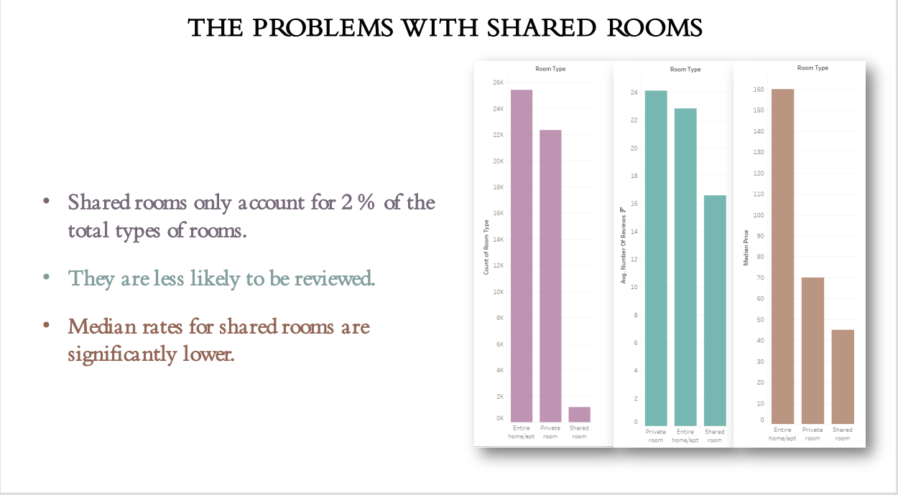
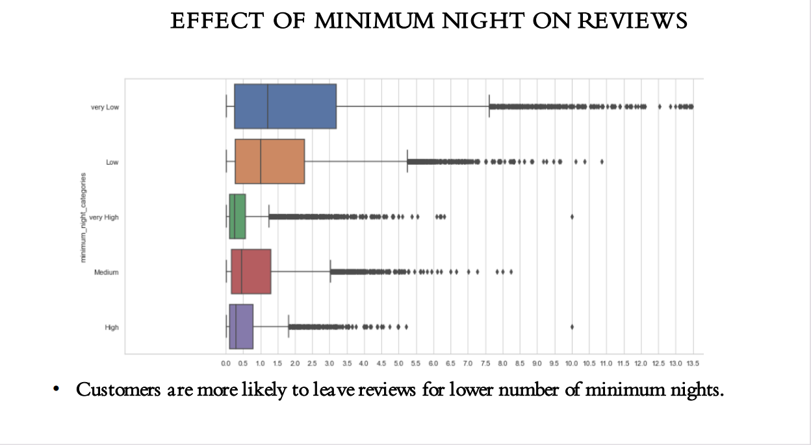
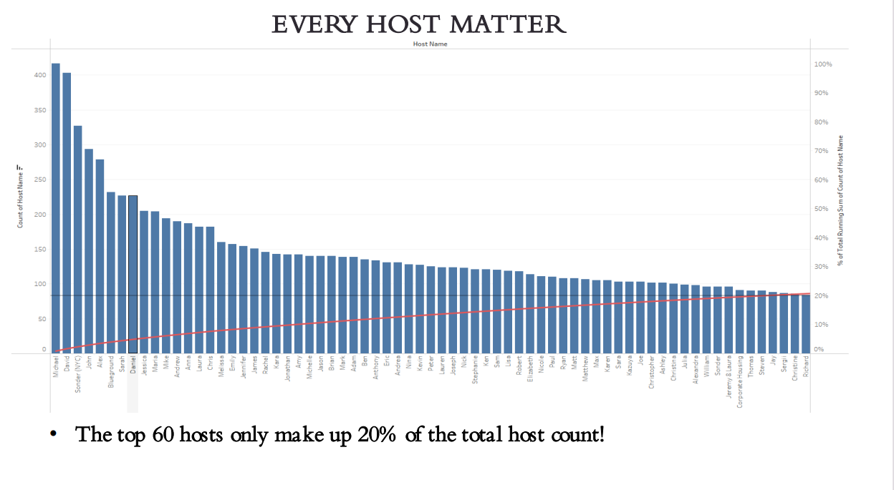
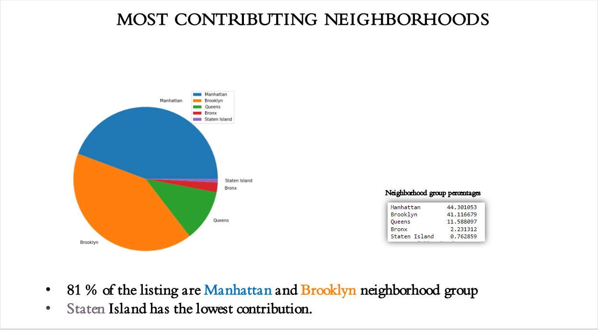
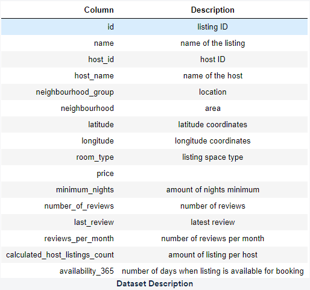
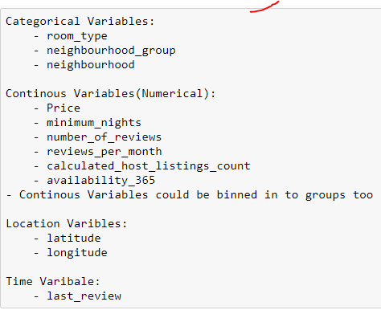

# Storytelling-Case-Study-Airbnb
 Visualise data related to Airbnbs in New York and present insights to various stakeholders.
 
 [python notebook](https://github.com/connectsoumyaroy/AirBNB-Storytelling-Case-Study/blob/main/AirBNB.ipynb) Contains the python code and analysis.
 
 [PPT-I.pdf](https://github.com/connectsoumyaroy/AirBNB-Storytelling-Case-Study/blob/main/Presentations/PPT-1.pdf) This presentation is heavily technical and is for Data Analysis Managers and Lead Data Analysts.
 
 [PPT-II.pdf](https://github.com/connectsoumyaroy/AirBNB-Storytelling-Case-Study/blob/main/Presentations/PPT-2.pdf) This presentation is for decision makers and stake holders.
 
 ## Objective
- To Provide insight into the current market situation.
- Enhance our understanding of property and host acquisitions, 
operations, and customer preferences.
- Provide early recommendations to our marketing and operations 
teams

prepare for the next best steps that Airbnb needs to take as a business, you have been asked to analyse a dataset consisting of various Airbnb listings in New York. Based on this analysis, give two presentations to the following groups.

## Presentation - I
[PPT-I.pdf](https://github.com/connectsoumyaroy/AirBNB-Storytelling-Case-Study/blob/main/Presentations/PPT-1.pdf)

This presentation is for,
- Data Analysis Managers: These people manage the data analysts directly for processes and their technical expertise is basic.
- Lead Data Analyst: The lead data analyst looks after the entire team of data and business analysts and is technically sound.

## Presentation - II
[PPT-II.pdf](https://github.com/connectsoumyaroy/AirBNB-Storytelling-Case-Study/blob/main/Presentations/PPT-2.pdf)

This presentation is for,
- Head of Acquisitions and Operations, NYC: This head looks after all the property and host acquisitions and operations. Acquisition of the best properties, price negotiation, and negotiating the services the properties offer falls under the purview of this role.
- Head of User Experience, NYC: The head of user experience looks after the customer preferences and also handles the properties listed on the website and the Airbnb app. Basically, the head of user experience tries to optimise the order of property listing in certain neighbourhoods and cities in order to get every property the optimal amount of traction.

## Dashboard

[Preview Tableau Dashboard](https://public.tableau.com/app/profile/soumya.roy4268/viz/AirBNB_17353017852250/Dashboard1)

An interactive dashboard is made to provide users with a dynamic and flexible way to explore and analyze data. This allows users to interact with data in real-time and customize the display of information to suit their needs.
<kbd>    </kbd>

## Key findings
These are the key findings to enhance our understanding of property and host acquisitions,operations, and customer preferences.

<kbd>    </kbd>
<kbd>    </kbd>
<kbd>    </kbd>
<kbd>    </kbd>

## Data
This [dataset](AB_NYC_2019.csv) contains information about different Airbnb listings along with their hosts, locations, prices and other attributes.

<kbd>    </kbd>

The [AB_NYC_2019_processed](AB_NYC_2019_processed.csv) dataset contains the cleaned,processed data with derived features.
<kbd>    </kbd> 

## Analysis (steps)
### 1. Importing libraries and reading the data
### 2. Creating features
#### 2.1 categorizing the "availability_365" column into 5 categories
#### 2.2 categorizing the "minimum_nights" column into 5 categories
#### 2.3 categorizing the "number_of_reviews" column into 5 categories
#### 2.4 categorizing the "price" column into 5 categories
### 3. Fixing columns
### 4. Data types
#### 4.1 Categorical
#### 4.2 Numerical
#### 4.3 Coordinates and date
### 5. Missing values
#### 5.1 Missing values Analysis
#### 5.2 Missing values Analysis ('neighbourhood_group' feature)
#### 5.3 Missing values Analysis ('room_type' feature)
### 6. Univariate Analysis
#### 6.1 name
#### 6.2 host_id
#### 6.3 host_name
#### 6.4 neighbourhood_group
#### 6.5 neighbourhood
#### 6.6 room_type
#### 6.7 price
#### 6.8 minimum_nights
#### 6.9 number_of_reviews
#### 6.10 reviews_per_month
#### 6.11 calculated_host_listings_count
#### 6.12 availability_365
#### 6.13 minimum_night_categories
#### 6.14 number_of_reviews_categories
#### 6.15 price_categories
### 7. Bivariate and Multivariate Analysis
#### 7.1 Finding the correalations
#### 7.2 Finding Top meaningful correlations
#### 7.3 number_of_reviews_categories and prices
#### 7.4 ('room_type' and 'number_of_reviews_categories')
#### 7.5 'room_type' and 'price_categories'
#### 7.6 'room_type' and 'reviews_per_month'
#### 7.7 minimum_night_categories and reviews_per_month
#### 7.8 'availability_365_categories', 'price_categories' and 'reviews_per_month'

## Recommendations

- Shared rooms need to be inspected upon.
- The cumulative contribution of all hosts is better than a few hosts doing well.
- More than 80 % of the listing areManhattan and Brooklyn neighborhood group.
- Minimum nights threshold should be on the lower side to make propertiesmore customer-oriented.

## Conclusion
- Strong significant insights are derived based on various attributes in the dataset.
- Ample amount and variety of visuals have can used in the presentations for the stake-holders.
- Data collection team should collect data about review scores so that it can strengthen the later analysis.
- A clustering machine learning model to identify groups of similar objects in datasets with two or more variable quantities can be made.
